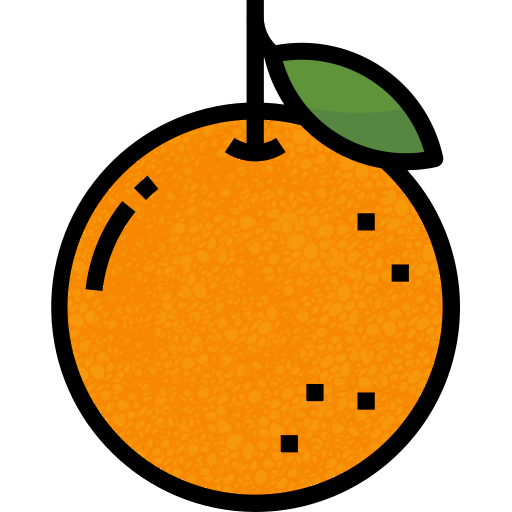
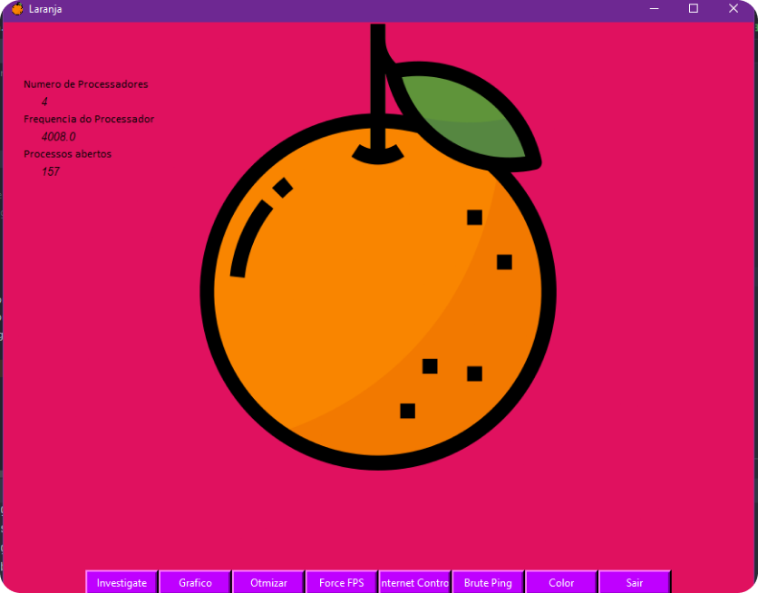
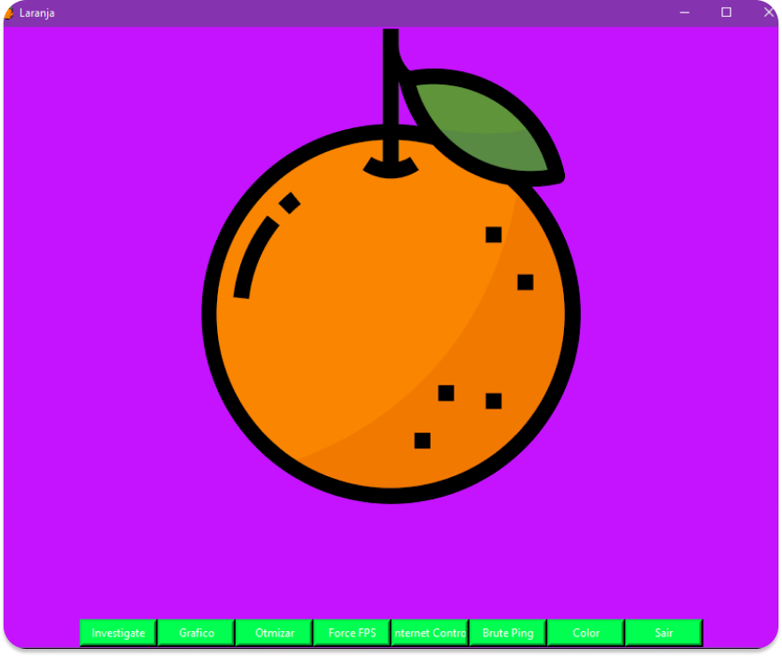

# <tittle> Laranja </tittle> :orange:
## Program to optimize and speed up PC performance in games.

### -Alpha Version-
    

# Welcome to Laranja 

For full documentation visit ......

## Commands

* `Laranja new ` - Projeto em version alpha .
* `......` - Start the live-reloading docs server.
* `......` - Build the documentation site.
* `......` - Print help message and exit.

## Project layout

