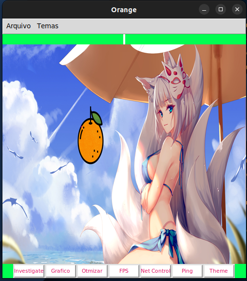

# <title>Orange</title> :orange:

## A program that optimizes the Windows 10 operating system for gaming by helping disable unnecessary processes while gaming.

---
#### -- Development Version 0.1.1 --
---

## Buttons

### Investigate

Used to investigate your operating system by reading all active processes on your computer.

### Graph

Used to open a real-time performance graph showing the resource consumption of your system.

Still under development.

shell
Copiar código

### Optimize

Optimizes your operating system by closing unnecessary processes for gaming.

### ForceFPS

Used to force the maximum performance of your computer.

Still under development.

bash
Copiar código

### Internet Control

Provides a small control panel where you can optimize your internet connection and make some adjustments.

Still under development.

shell
Copiar código

#### Brute Ping

Used to calculate the ping.

Still under development.

yaml
Copiar código

## Tools

1. Language: [Python](https://www.python.org/)
2. Framework: [Tkinter](https://docs.python.org/3/library/tkinter.html)
3. Hosting Platform:

## Get Started

1. Download the orange folder along with its code.
2. Add the necessary libraries for your project in the [requirements.txt](./requirements.txt) file.
3. I'm using Linux Ubuntu 22.04.2 LTS.

## Test Locally

To test locally, execute the following command in the directory:

On Linux:

~~~ 
python3 /orange/main/laranja.py
~~~

On Windows:

~~~ 
python /orange/main/laranja.py
~~~

## Note

Once I finish creating all the buttons, I will create the compiled file.




---
Developed by [Anderson B.O.B](https://github.com/eusouanders)

---

## Tree

```bash
anderson@DESKTOP-ROPF13S:~/projects/orange$ tree
.
├── Dockerfile
├── Docs
│   └── style_docs
│       └── styles.md
├── LICENSE
├── README.md
├── build.sh
├── config.json
├── docker-compose.yml
├── poetry.lock
├── pyproject.toml
├── requirements.txt
├── src
│   ├── __init__.py
│   ├── assets
│   │   └── images
│   │       ├── background
│   │       │   ├── 1.jpg
│   │       │   ├── 2.jpg
│   │       │   ├── 3.jpg
│   │       │   ├── 4.jpg
│   │       │   └── 5.jpg
│   │       ├── orange.png
│   │       └── screenshots
│   │           ├── orange.png
│   │           ├── screenshot1.png
│   │           ├── screenshot2.png
│   │           ├── screenshot3.png
│   │           ├── screenshot4.png
│   │           ├── screenshot7.png
│   │           └── screenshot8.png
│   ├── build
│   │   ├── build
│   │   │   ├── Orange
│   │   │   │   ├── Analysis-00.toc
│   │   │   │   ├── EXE-00.toc
│   │   │   │   ├── Orange.pkg
│   │   │   │   ├── PKG-00.toc
│   │   │   │   ├── PYZ-00.pyz
│   │   │   │   ├── PYZ-00.toc
│   │   │   │   ├── base_library.zip
│   │   │   │   ├── localpycs
│   │   │   │   │   ├── pyimod01_archive.pyc
│   │   │   │   │   ├── pyimod02_importers.pyc
│   │   │   │   │   ├── pyimod03_ctypes.pyc
│   │   │   │   │   └── struct.pyc
│   │   │   │   ├── warn-Orange.txt
│   │   │   │   └── xref-Orange.html
│   │   │   └── main
│   │   │       ├── Analysis-00.toc
│   │   │       ├── EXE-00.toc
│   │   │       ├── PKG-00.toc
│   │   │       ├── PYZ-00.pyz
│   │   │       ├── PYZ-00.toc
│   │   │       ├── base_library.zip
│   │   │       ├── localpycs
│   │   │       │   ├── pyimod01_archive.pyc
│   │   │       │   ├── pyimod02_importers.pyc
│   │   │       │   ├── pyimod03_ctypes.pyc
│   │   │       │   └── struct.pyc
│   │   │       ├── main.pkg
│   │   │       ├── warn-main.txt
│   │   │       └── xref-main.html
│   │   ├── build.py
│   │   ├── dist
│   │   │   └── Orange
│   │   └── specs
│   │       ├── Orange.spec
│   │       └── main.spec
│   ├── collor.py
│   ├── config
│   │   ├── __init__.py
│   │   ├── __pycache__
│   │   │   ├── __init__.cpython-312.pyc
│   │   │   ├── background.cpython-312.pyc
│   │   │   ├── choose.cpython-312.pyc
│   │   │   ├── clean.cpython-312.pyc
│   │   │   ├── save.cpython-312.pyc
│   │   │   ├── save_user_config.cpython-312.pyc
│   │   │   └── themes.cpython-312.pyc
│   │   ├── background.py
│   │   ├── choose.py
│   │   ├── clean.py
│   │   ├── config.json
│   │   ├── save_user_config.py
│   │   └── themes.py
│   ├── core
│   │   ├── __pycache__
│   │   │   └── reload.cpython-312.pyc
│   │   ├── main.py
│   │   └── reload.py
│   ├── data
│   │   └── __init__.py
│   ├── graphic
│   │   └── __init__.py
│   ├── test.py
│   └── theme
│       └── __init__.py
└── start.sh
```